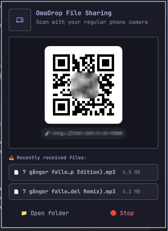

# OmaDrop 🚀📱💻
**Zero-App QR File Sharing Between Phone & PC for [Omarchy](https://omarchy.org) / Quickshell**

Transfer photos, videos, and files between your smartphone (iPhone or Android) and your Linux PC with **zero apps to install on your mobile device**!



---

## ✨ Features

* **📷 Zero Mobile Installation:** Simply point your regular phone camera at the QR code on your top bar to open the transfer portal on your local Wi-Fi.
* **📱 Send from Phone to PC:** Tap to pick photos, videos, or documents on your phone — files transfer instantly to your computer's `~/Downloads/OmaDrop/` folder.
* **🔔 Native Desktop Notifications:** Get an immediate desktop notification with sound and file count as soon as transfers complete.
* **💻 Send from PC to Phone:** Place files in `~/Downloads/OmaDrop/Send/` and download them directly to your phone with one tap.
* **📊 Progress & Streaming:** Real-time upload percentage, transfer speed, and recent received file list in the top bar popup.
* **🌐 Automatic System & Browser Language (i18n):** Automatically adapts to the user's native language on both PC and mobile! Supports English, Swedish (Svenska), Dutch (Nederlands), Japanese (日本語), German (Deutsch), French (Français), Spanish (Español), and Chinese (中文).
* **🔒 100% Local & Private:** Direct peer-to-peer over your local Wi-Fi network. No cloud, no external servers, no tracking.

---

## 📦 Installation

### 1. Clone into your Omarchy plugins directory

```bash
git clone https://github.com/alexwest1981/OmaDrop.git ~/.config/omarchy/plugins/custom.omadrop
```

### 2. Enable in `~/.config/omarchy/shell.json`

Add `custom.omadrop` to your `bar.layout.right`:

```json
{
  "bar": {
    "layout": {
      "right": [
        { "id": "custom.displays" },
        { "id": "custom.omadrop" },
        { "id": "omarchy.tray" }
      ]
    }
  }
}
```

### 3. Allow OmaDrop in your Firewall (Port 5380)

Linux firewalls block incoming connections from the local network by default. Allow incoming traffic on port `5380/tcp`:

* **If you use UFW (Omarchy default):**
  ```bash
  sudo ufw allow 5380/tcp
  ```

* **If you use firewalld:**
  ```bash
  sudo firewall-cmd --add-port=5380/tcp --permanent
  sudo firewall-cmd --reload
  ```

* **If you use nftables:**
  ```bash
  sudo nft add rule inet filter input tcp dport 5380 accept
  ```

### 4. Restart Omarchy Shell

```bash
omarchy-restart-shell
```

---

## 🛠️ Troubleshooting & Checklist

* **Same Wi-Fi Network:** Make sure your smartphone and your PC are connected to the same local Wi-Fi router (not mobile data 4G/5G).
* **AP/Client Isolation:** Some guest Wi-Fi networks have "Client Isolation" enabled, which prevents local devices from talking to each other. Use your standard home/office Wi-Fi.
* **Storage Location:** Received files are saved in `~/Downloads/OmaDrop/Received/`.

---

## 📄 License

MIT License © 2026 [Alex Weström](https://github.com/alexwest1981)
